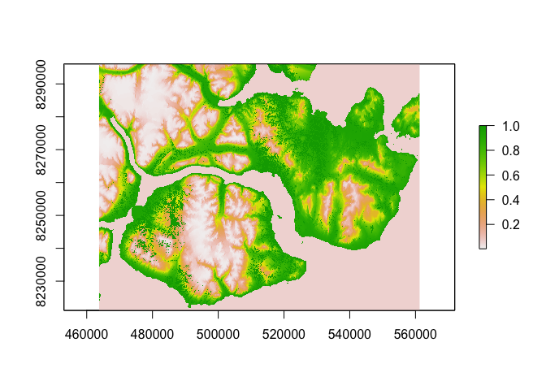
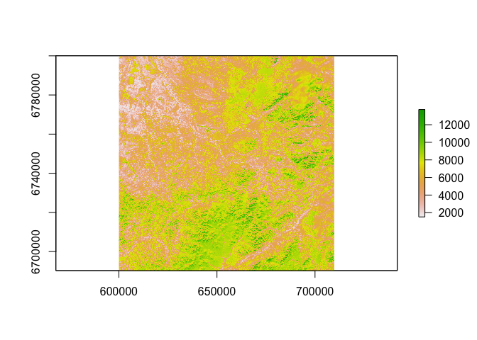

Applicant: [Babak Naimi](https://github.com/babaknaimi), ETH Zurich, Switzerland (<naimi.b@gmail.com>)

Package: [mraster](https://github.com/babaknaimi/mraster)

### Introduction

Raster/Image datasets have been increasingly available (e.g., satellite images) in various domains/applications that can be usually considered as big datasets. A big dataset is refered to a dataset that cannot be fitted in a memory, therefore, needs a proper solution to deal with, otherwise, an error is returned indicating the problem. Several packages have been introduced in R to handle and work with raster/image datasets. Among the packages, the package raster is the one that is well-known and rich (in terms of functionalities and implementation), providing the raference classes for different raster data types (e.g., single or multi-bands/layers) that has been used by many users/developers. To process a big datasets, the raster package uses a solution reads the data partially (part of the data, also called a chunk of data), process the chunk, and then go to the next part/chunk, repeat the procedure until all the chunks are read and processed. Although this procedure works, but is not efficient means make the process much slower compared to when the whole dataset is loaded in memory.

As a more efficient solution (see the demo section), we offer to use/adapt the well-known method that maps the memory into the file, means each part of a data file can be accessed randomly without the need of loading the file into the memory. This project aims to provide a framework that offers the required classes and functionalities to use this solution to deal with big spatial raster datasets. This can be adapted for the other types of data but given that raster datasets are potentially big data, they are targeted at the first phase of this project.

### The Problem

How can we handle and process a big raster/image dataset (e.g., satellite image) that don't fit in memory with R? How can we make the read/write of such datasets more efficient? How their visualisations can become more efficient? How a standard multi-level tile-mosaicing procedure can be adapted for local file-based raster data storage to optimise their visualisation and handling? How and whether the solution can be adapted to be used by parallelized processing of raster datasets?

### The Plan

We will develop an R package (its implementation has already been started) to handle image/raster:

-   provide accessing raster datasets without loading them into memory
-   easily/efficiently subsetting and binding datasets
-   efficiently reading/writing raster/image data
-   designing an indexing system together with an efficient organisation of (multi-) file-based storages to optimise the speed of accessing different parts of a dataset
-   design a tile-based mosaicing of images to handle multi-level access and maximise efficiency of visualisations
-   test whether the solution can be adapted for parallel processing tasks (i.e., a single source of data will be accessed by multiple cores)

We will document the software and provide tutorials and reproducible data analysis examples.

We will also develop and discuss how the functions in the existing packages (e.g., raster) can be benefitted by using this new package.

We will publish the resulting products in an open access form, in a journal (or on a conference) more directed to the Earth observation community.

Timeline:

-   Month 1-3: work out design
-   Month 4-8: programming the R package, testing with a set of sample datasets
-   Month 9-12: write tutorials, develop teaching material and reproducible examples
-   Month 9-12: experiment in different platforms and for different processing pipelines

### How Can The ISC Help:

I request 10,000 USD that all will be used to develop the R package.

Part of this funding may be used to hire a student assistant for one year (8500 UDS), or will compensate the salary of the applicant for the time that he dedicates to implement the package.

1500 USD will be used to present the results in a relevant conference (e.g., UseR! 2019).

### Dissemination

The project has been already started on github, and will be continuting on the [same repository](https://github.com/babaknaimi/mraster), information will be shared and reactions and contributions invited through r-sig-geo, as well as StackOverflow and GIS StackExchange. The project will use an Apache 2.0 license for maximum dissemination. The work will be published in 2 blogs, announced on r-sig-geo, and intermediary results will be presented at UseR! 2019. The final result will be published in a paper submitted to the Journal of Statistical Software; this paper will be available before publication as a package vignette.

### Proof of concept

In order to show the problem and as a proof of concept to show how efficient the solution, following I showed some tests based on the preliminary functions that I already implemented in the package.

#### Example 1:

Let's try a raster file that can be loaded into memory Different solutions are tested: \* solution1: when data are loaded in memory \* solution2: when data are in disk but will be handled by the method implemented in the raster package \* solution3: This is the solution offered by this package, i.e., data are in disk and will be handled by mapping the memory to the file (mraster package)

``` r
library(raster)

library(mraster)

library(microbenchmark)
```

``` r
#######################
#   Example 1: This example uses a raster file that can be loaded in memory, but
# tests the performance using different solutions 
# (i.e., either when the data are in memory or they read from disk)

# the raster file: 'test.gri'
fsize <- file.size('test1.gri')

fsize # file size in Byte
```

    ## [1] 64974000

``` r
mraster:::.change_unit(fsize,'B','M') # change Byte to MByte
```

    ## [1] 61.96404

``` r
#--------------

# read the raster file using the raster package:
in.memory.using.raster <- raster('test1.gri')

in.disk.using.raster <- raster('test1.gri')

in.memory.using.raster <- readAll(in.memory.using.raster) # the raster values are loaded into memory

inMemory(in.memory.using.raster) # test whether the values are in memory or not
```

    ## [1] TRUE

``` r
inMemory(in.disk.using.raster) # the values are in disk
```

    ## [1] FALSE

``` r
plot(in.memory.using.raster) # plot of the image (using the package raster)
```



``` r
#-------------
# read the raster using the mraster package (using mapping the memory to the file solution):
map.to.file.using.mraster <- mraster('test1.gri')

#-----------------
# to get values at a cell(s), the cell number(s) can be specifies as a vector:

# get the value at a cell (e.g., 100000) using the package raster:
in.memory.using.raster[100000]
```

    ##            
    ## 0.05660474

``` r
in.disk.using.raster[100000]
```

    ##            
    ## 0.05660474

``` r
# get the value at the same cell using the package mraster:
getRasterValues(map.to.file.using.mraster,100000)
```

    ##        pp2.1
    ## 1 0.05660474

``` r
# let's test the performance of getting the values from a vector of cell (indx)

# here, we test and compare extracting of 100,000 records from the raster layer 
# using the three solutions:

indx <- 4000000:4100000 # get 100,000 records
b <- microbenchmark(in.memory.using.raster[indx],in.disk.using.raster[indx],
                    getRasterValues(map.to.file.using.mraster,indx),times=10L)

b
```

    ## Unit: milliseconds
    ##                                              expr        min         lq
    ##                      in.memory.using.raster[indx] 245.859525 247.271464
    ##                        in.disk.using.raster[indx] 450.301723 467.774452
    ##  getRasterValues(map.to.file.using.mraster, indx)   4.196244   4.403581
    ##      mean     median         uq       max neval
    ##  254.6484 256.342255 257.852977 266.29828    10
    ##  529.4606 508.641017 612.981192 650.29489    10
    ##    9.1769   4.504786   5.364185  34.71577    10

    ## The solution offered in this proposal is 57.69493 times faster than when the raster object 
    ##  is on the disk, accessed from the raster package

    ## The solution offered in this proposal is 27.74885 times faster than when the raster object 
    ##  is loaded in the memory, accessed from the raster package

``` r
# here, we test and compare extracting of 1,000,000 records (10 times more) from the raster layer
# using the three solutions:

indx <- 4000000:5000000 # get 1,000,000 records
b <- microbenchmark(in.memory.using.raster[indx],in.disk.using.raster[indx],getRasterValues(map.to.file.using.mraster,indx),times=10L)

b
```

    ## Unit: milliseconds
    ##                                              expr        min         lq
    ##                      in.memory.using.raster[indx] 1431.95256 1509.95678
    ##                        in.disk.using.raster[indx] 1760.68911 1833.89363
    ##  getRasterValues(map.to.file.using.mraster, indx)   27.27491   31.13749
    ##        mean     median         uq        max neval
    ##  1524.04300 1523.02015 1552.04908 1592.66987    10
    ##  1852.19292 1847.15600 1869.77758 1938.33545    10
    ##    41.58569   37.80746   57.75817   60.45012    10

``` r
#---------
```

    ## The solution offered in this proposal is 44.53918 times faster than when the raster object 
    ##  is on the disk, accessed from the raster package

    ## The solution offered in this proposal is 36.64825 times faster than when the raster object is 
    ##  loaded in the memory, accessed from the raster package

#### Example 2:

In this example, we try a raster file that cannot be loaded in the memory Two solutions are tested: \* solution1: when data are in disk and will be handled by the method implemented in the raster package \* solution2: This is the solution offered by this package, i.e., data are in disk and will be handled by mapping the memory to the file (mraster package)

``` r
#######################
#   Example 2: This example uses a big raster file that cannot be loaded in memory

# the raster file: 'big '
fsize <- file.size('bigRaster.gri')

fsize # file size in Byte
```

    ## [1] 7715865600

``` r
mraster:::.change_unit(fsize,'B','M') # change Byte to MByte
```

    ## [1] 7358.423

``` r
mraster:::.change_unit(fsize,'B','G') # the size is > 7 GigaBytes
```

    ## [1] 7.18596

``` r
#--------------

# read the raster file using the raster package:
in.disk.using.raster <- brick('bigRaster.gri') # it is a multi-band (multi-layer) image

inMemory(in.disk.using.raster) # the values are in disk
```

    ## [1] FALSE

``` r
plot(in.disk.using.raster[[1]]) # plot the first layer of the image (using the package raster)
```



``` r
# read the raster using the mraster package (using mapping the memory to the file solution):
map.to.file.using.mraster <- mraster('bigRaster.gri')


# here, we test and compare extracting of 100,000 records from the raster layer 
# using the two solutions:

indx <- 4000000:4100000 # get 100,000 records
b <- microbenchmark(in.disk.using.raster[indx],getRasterValues(map.to.file.using.mraster,indx),times=2L)

b
```

    ## Unit: milliseconds
    ##                                              expr         min          lq
    ##                        in.disk.using.raster[indx] 22898.20218 22898.20218
    ##  getRasterValues(map.to.file.using.mraster, indx)    34.21134    34.21134
    ##         mean      median          uq         max neval
    ##  22958.36274 22958.36274 23018.52331 23018.52331     2
    ##     47.82304    47.82304    61.43475    61.43475     2

``` r
#---------
```

    ## The solution offered in this proposal is 480.069 times faster than when the raster object 
    ##  is on the disk, accessed from the raster package

``` r
# here, we test and compare extracting of 1,000,000 records (10 times more) from the raster layers
# using the two solutions:

indx <- 4000000:5000000 # get 1,000,000 records
b <- microbenchmark(in.disk.using.raster[indx],getRasterValues(map.to.file.using.mraster,indx),times=2L)

b
```

    ## Unit: milliseconds
    ##                                              expr         min          lq
    ##                        in.disk.using.raster[indx] 227434.8957 227434.8957
    ##  getRasterValues(map.to.file.using.mraster, indx)    354.2619    354.2619
    ##         mean      median          uq         max neval
    ##  229940.9455 229940.9455 232446.9952 232446.9952     2
    ##     389.3777    389.3777    424.4935    424.4935     2

    ## The solution offered in this proposal is 590.5344 times faster than when the raster object 
    ##  is on the disk, accessed from the raster package
